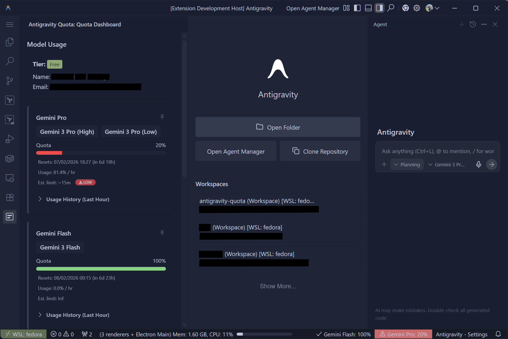

# Antigravity Quota

Antigravity Quota is a VS Code extension that displays your Antigravity usage
and quota directly in the status bar and sidebar.

## Features

- **Status Bar Integration**: View your current quota usage at a glance.
- **Quota Dashboard**: A dedicated sidebar view to see detailed usage statistics.
- **Automatic Refresh**: Keeps your quota information up-to-date.

